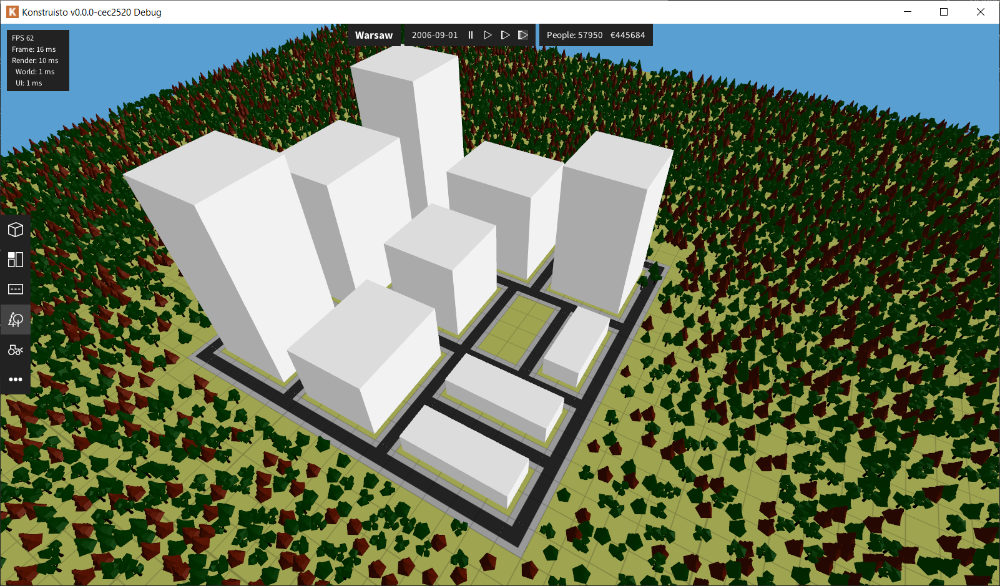

<p align="center">
  
</p>

Simple city-builder using OpenGL. For Windows and Linux. See http://konstruisto.com/ for more.

## Building

There are two building toolchains:

1. Linux/Windows GNU headers using Makefile and Clang
1. Windows MSVC build using Visual Studio and Clang

Only x64 builds are supported. MSVC is preferred for Windows. Windows GNU version is no longer maintained and will be removed.

### Building on Linux

1. Set up dependencies (below)
1. Run `make rebuild run`

To build release configuration: `make rebuild run CONFIG=RELEASE`. Command `make help` shows all possible options.

#### Linux dependencies

You can just run `setup-deps.sh`, it will setup everything for you.

    git clone git@github.com:kantoniak/konstruisto.git konstruisto &&
    cd konstruisto &&
    chmod +x ./scripts/setup-deps.sh &&
    sudo ./scripts/setup-deps.sh &&
    cd - &&
    make build run

If you want to do everything by hand, here's the list of dependencies:

1. Install `clang-9 clang-format-9 clang-tidy-9 clang-tools-9`.
1. Install `libglew-dev` (2.1.0): https://launchpad.net/ubuntu/+source/glew
1. Install `libglfw3-dev` (3.3): https://launchpad.net/ubuntu/+source/glfw3
1. Download `glm` and extract to `ext/glm-0.9.9.6`
    ```
    wget https://github.com/g-truc/glm/releases/download/0.9.9.6/glm-0.9.9.6.zip &&
    unzip glm-0.9.9.6.zip -d ext/ &&
    mv "ext/glm" "ext/glm-0.9.9.6" &&
    rm 0.9.9.6.zip
    ```
1. Download `cereal` and extract to `ext/cereal-1.3.0`
    ```
    wget https://github.com/USCiLab/cereal/archive/v1.3.0.zip --no-check-certificate -O cereal-1.3.0.zip &&
    unzip cereal-1.3.0.zip -d ext/ &&
    rm cereal-1.3.0.zip
    ```
1. Download `stb_image.h` to `ext/stb/stb/stb_image.h`
    ```
    mkdir -p ext/stb/stb/ &&
    wget https://raw.githubusercontent.com/nothings/stb/master/stb_image.h -P ext/stb/stb/
    ```
1. Build and install `nanovg` (you will need `premake5`)
    ```
    git clone git@github.com:memononen/nanovg.git ext/nanovg &&
    cd ext/nanovg &&
    premake5 --cc=gcc gmake &&
    mv build/ build-linux/ &&
    cd build-linux/ &&
    make config=release64 nanovg
    ```

### Windows

In case of MSVC set up shared dependencies and run build from Visual Studio. For MinGW headers build you will have to put some programs in the `PATH` (see below).

#### Shared Windows dependencies

1. Install GLEW in `ext/glew-2.1.0`
1. Install GLFW in `ext/glew-3.3`
1. Extract `glm` library to `ext/glm-0.9.9.6`
1. Extract `cereal` library to `ext/cereal-1.3.0`
1. Put `stb_image.h` to `ext/stb/stb/stb_image.h`
1. Build and install `nanovg` (see below)

#### GNU-specific dependencies

1. You will need `make`, `clang`, `clang++`, `clang-format` in `PATH`.
1. You will need `windres` in `PATH` from `mingw-w64`

### Building `nanovg`

You will need `premake5` [(download)](https://premake.github.io/download.html).

1. Extract repo into `ext/nanovg`.
1. Build x64 release:

    ```
    cd ext/nanovg
    premake [vs2019|--cc=gcc gmake]
    mv build build-[msvc|windows|linux]
    cd build-[msvc|windows|linux]
    make config=release64 nanovg
    ```

##  license

Copyright &copy; 2017-2019 Krzysztof Antoniak

Contents of this repository is licensed under GNU General Public License, version 3.0 (GPL-3.0) with additional term according to the section 7(c) of the license: should you make a derivative of this repository, please do not use the name "Konstruisto", Konstruisto logo or use similar naming for your game what could misguide users. See [LICENSE.txt](LICENSE.txt) for details.

### Used libraries

* [GLFW 3.3](http://www.glfw.org/) under the zlib/libpng license
* [GLEW 2.1.0](http://glew.sourceforge.net/) under the Modified BSD License, the Mesa 3-D License (MIT) and the Khronos License (MIT)
* [GLM 0.9.9.6](http://glm.g-truc.net/0.9.9.6/index.html) under the MIT License
* [Cereal 1.3.0](http://uscilab.github.io/cereal/) under BSD license
* [NanoVG](https://github.com/memononen/nanovg) under the zlib/libpng license
* [stb_image](https://github.com/nothings/stb/blob/master/stb_image.h), a public license image loading library
